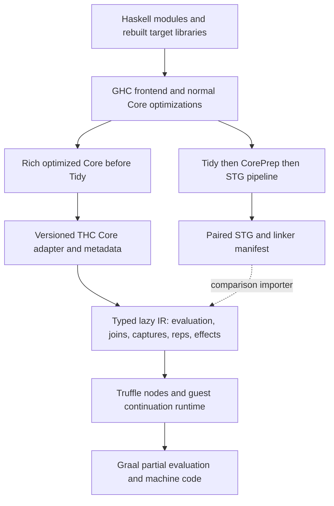

# THC: architecture and GHC boundary decision

Historical design proposal, written 2026-09-22 before the THC prototype was implemented. At that point the evidence was source inspection and a native GHC experiment, with no THC performance result. The alternatives and future-tense recommendations below preserve that original proposal; they are not the current implementation description. The subsequent prototype uses the GHC 9.14.1 exporter. See the [current build and status](../README.md) and [Map report](map-example.md). Cadenza was inspected without modification.

## Decision: Core first, with STG retained as a reference

**The hypothesis that Core leaves more optimization room is substantially right.** THC should capture rich optimized Core at the end of GHC's normal Core optimization pipeline, **before Tidy and CorePrep**, then perform its own JVM-oriented lowering. Preserve a paired optimized STG artifact and the information needed to compare the two paths. Use that STG as a semantic/lowering reference and an experimental baseline, rather than making its closure and argument decisions the only available input.

“Core first” names the authoritative artifact and intended JVM lowering, not a requirement to finish a general Core backend before any runtime smoke test. A small STG importer is an optional bootstrap/reference path when it shortens the experiment. The shared runtime and controlled Core-versus-STG experiment, not the order in which an importer first runs, determine the eventual production boundary.

This is a provisional architecture decision, not a measured claim that a Core backend is faster. It makes the most useful information available before committing to JVM layout, evaluation placement, closure conversion and calling conventions. CorePrep is an excellent specification and comparison point for correctness; its already-normalized output is a less attractive sole archival boundary. STG is a credible simpler backend input, and a Core backend must earn its added complexity with measurements.

The important qualification is **optimized** Core. GHC has already performed most library-driven fusion, specialization, simplification, strictness analysis and worker-wrapper transformation. Those successes also survive as executable structure in STG. Choosing Core does not magically restore pre-inlining abstractions or undo earlier native-oriented heuristics. If an experiment needs to change worker-wrapper, specialization or float decisions, it must change the GHC pipeline/configuration or add a deliberate earlier checkpoint. Do not move the entire boundary earlier merely in the hope that more syntax means better code.

The proposed default is:

Source evidence and exact hooks are in [the GHC boundary study](../research/ghc-boundary.md); whole-program constraints are in [the exporter audit](../research/whole-program.md). GHC's [Core source](https://github.com/ghc/ghc/blob/3f4d7d38b9661435bdde981451ac50c4335ed090/compiler/GHC/Core.hs), [CorePrep](https://github.com/ghc/ghc/blob/3f4d7d38b9661435bdde981451ac50c4335ed090/compiler/GHC/CoreToStg/Prep.hs), and [STG syntax](https://github.com/ghc/ghc/blob/3f4d7d38b9661435bdde981451ac50c4335ed090/compiler/GHC/Stg/Syntax.hs) ground this decision.

## Boundary comparison

| Concern | Rich optimized Core, pre-Tidy | CorePrep | Optimized STG |
|---|---|---|---|
| Types and representation | System FC expressions retain type/coercion structure; binders, types, constructor metadata and runtime representations available. Best place to export proofs and intent. | Still Core syntax and useful types, but normalized and prepared for STG; some metadata trimmed. | Uses `Id`, `Type`, `DataCon` and runtime reps in memory. Explicit type application/cast syntax is gone; unarisation changes representation. It is neither untyped nor full FC. |
| Demand, strictness, usage, CPR | Rich `IdInfo`, demand signatures, cardinality, one-shot information, CPR, occurrence and unfolding context can be collected. Some analyses are already simplified or stale outside their documented invariants. | Uses strictness to select case/let evaluation structure; removes executable unfoldings/rules in important places, not all `IdInfo`. | Many annotations remain in GHC's own STG; demand decisions also appear in cases, closure/update flags and binding structure. An external exporter may discard much more. |
| Arity and calls | Function arity, call-arity, join arity and types are distinct; can preserve all, then choose JVM ABI. | Saturates relevant applications and restricts expression forms; more calling decisions are committed. | Explicit closure arguments and applications; representation arity depends on STG stage. Good execution input, less high-level context. |
| Join points | Explicit joins, join arity and jumps support control-flow lowering. | Preserves enough structure for Core-to-STG conversion. | Let-no-escape/non-escaping closures preserve valuable control-flow intent. No need to heap-allocate every STG binding. |
| Specialization and fusion | Specialized workers and fused loops already present; remaining unfoldings/RULES and dictionaries support further justified work. | Existing optimized code remains, but the convenient rewrite context is reduced. | Existing fusion/specialization survives. Recovering generic producer/consumer structure or re-running type-directed transformations is harder. |
| Evaluation and sharing | JVM lowering must decide when an expression is an atom, eager computation, shared thunk, or single-entry suspension, preserving Core semantics. | Gives a proven reference for atomization, saturation and strictness-sensitive evaluation placement. | Update flags and closure RHSs make the evaluator contract much more explicit. Still requires a correct lazy runtime. |
| Closure transformations | Most freedom for JVM escape analysis, environment splitting, static allocation, selected lambda lifting and typed worker calls. | Some let/case/eta choices fixed; JVM layouts still open. | Closure structure/free-variable information makes implementation easier; native-oriented late lifting, tags and representation expansion may be undesirable depending on stage/flags. |
| Implementation risk | Highest: a genuine typed lowering pass, analysis invalidation, representation handling and lazy semantics. | Intermediate; not a stable interchange format and not an optimizer replacement. | Lowest route to an operational evaluator, but external metadata quality and whole-library extraction remain hard. |

**Do not conflate GHC's in-memory STG with External STG.** The former demonstrably retains useful types and `IdInfo`; the WPC external format has a documented metadata gap. The right comparison is rich Core versus an explicitly specified STG phase/export schema, not “typed Core versus untyped STG.”

**Do not confuse source arity with storage.** Type arguments are erased; some zero-width value/coercion arguments still matter for saturation. One unboxed tuple may occupy multiple payload slots. Export separate application/entry and storage descriptors. Derive them from the chosen GHC phase and verify their relationship, rather than counting arrows or Java array cells.

### Which optimizations belong where?

Keep GHC's mature simplifier, specialization, dictionary elimination, demand/CPR analysis, worker-wrapper, case transformations and library RULES by default. GHC's later Cmm/native backend optimizations, register allocation and instruction selection are not inherited; THC/Graal must produce its own machine-level results. In the local 9.14.1 probe, a `foldl'` over `map` and `filter` is already one worker loop in Tidy Core, and remains so in STG. A worker's Core join becomes STG let-no-escape. See [the actual probe](../research/cadenza-and-probe.md).

THC's first Core lowering should be conservative: explicit evaluation, correct runtime reps, joins as control flow, closure environments, and stable link identities. The importer must also account for implicit constructor entry points, compiler-known pseudo-IDs, bignum literals and special forms such as `runRW#` according to the pinned GHC version. Serializing `mg_binds` alone is not a complete execution specification: for example, 9.10.3 CorePrep synthesizes constructor workers, whereas that step differs in 9.14.1. These are explicit lowering responsibilities, not missing ordinary package bodies.

Its first JVM-specific optimizations should target concrete costs: avoid allocation for known strict primitive arguments; put proven primitive captures in typed fields; eliminate non-escaping constructors/tuples; specialize known constructor cases; lower local joins to loops; preserve direct calls; and select a bounded generic application fallback. Recompute or conservatively discard analyses invalidated by rewriting. A demand signature is not permission to force a value before a conditional branch or across an effect.

Later experiments can compare GHC worker-wrapper thresholds, dictionary specialization, inlining and lambda lifting against JVM costs. Excessive lifting can turn a small captured environment into large call packets; excessive inlining can overwhelm Graal or produce poor code. Final STG with native tag-enforcement or late lifting is not automatically the fairest STG baseline. Record exact pipeline flags and consider an earlier STG snapshot alongside final STG.

## Export and whole-program architecture

### Actual tools versus proposed THC work

**Available, verified APIs:** a Core plugin installed through `installCoreToDos` can append a `CoreDoPluginPass`; this is the natural pre-Tidy capture point. `compileToCoreSimplified` returns simplified **and tidied** Core, so its convenient name does not imply maximal retained metadata. `latePlugin` exists from GHC 9.10.1 and sees post-Tidy, pre-CorePrep `CgGuts`; it is useful but later. GHC supports `-fwrite-if-simplified-core` and version-specific interfaces containing full simplified bindings. These are GHC APIs/formats, not a stable cross-version THC interchange protocol. [Plugin API](https://github.com/ghc/ghc/blob/3f4d7d38b9661435bdde981451ac50c4335ed090/compiler/GHC/Driver/Plugins.hs), [driver pipeline](https://github.com/ghc/ghc/blob/3f4d7d38b9661435bdde981451ac50c4335ed090/compiler/GHC/Driver/Main.hs).

**Available exporter, with caveats:** audited WPC revision `a99ba59f7286a46aed19e9faba3acc6833b21920` emits binary External STG, dump files, link metadata **and** `module.fullcore-hi`. It is more useful than “an STG exporter only,” but its full-Core artifact is not the rich pre-Tidy capture proposed here. Its build pins GHC 9.10.3 exactly; a broad README compatibility statement is not a tested 9.14 compatibility guarantee. Its program loader can silently filter missing exports/modules. Its boot-library recipe and exporter HEAD are not automatically a coherent tested toolchain. [WPC source](https://github.com/grin-compiler/ghc-whole-program-compiler-project/tree/a99ba59f7286a46aed19e9faba3acc6833b21920).

**Proposed THC additions:** a small GHC-version adapter that exports the pre-Tidy view; an explicit schema and metadata sidecar; a complete dependency/foreign-symbol inventory; fail-closed link validation; and an importer into THC's typed lazy IR. No such THC components are implemented in this deliverable. A two-view archive reduces information loss, but does not eliminate the need for this adapter.

### The archive contract

Each module archive should contain:

- GHC exact release/commit, adapter/schema revision, target platform and word size, relevant flags, source/interface hashes, unit/package/module identities and dependency fingerprints.
- Binding identities stable within the archive, full executable bindings, types/coercions as required by lowering, constructor/tycon representation data, foreign declarations, rules/unfoldings and the selected `IdInfo` fields with phase provenance.
- Entry arity, join arity, argument/result runtime reps, strictness/demand/cardinality/CPR and unfolding availability. Missing information must be represented as unknown, not guessed.
- Optional paired CorePrep/STG views and a cross-view identity/provenance map. Fresh binders and transformed groups prevent a naive one-to-one binder match; compare entry behavior and transformations rather than assuming unchanged uniques.
- Link roots, unit dependency graph, foreign/native object requirements, CAF/static roots and unsupported-feature diagnostics.

Read a `.fullcore-hi` with the matching GHC adapter; do not reverse-engineer pretty-printed dumps as a production format. Convert version-specific entities to an explicitly versioned THC schema. Local `Unique`s alone are not global linker names. Use unit identity plus module/name for external symbols and archive-scoped identities for locals. Record native assumptions already baked into constant folding and primitive widths.

### Libraries and linking

The target needs executable IR for every reachable Haskell definition. Ordinary installed `.hi` files contain selected unfoldings, not a guaranteed implementation of every function; native `.o` files cannot supply a Java implementation. Rebuild/export reachable library packages with the selected toolchain, or reuse matching complete export archives. This includes the appropriate version's `ghc-prim`, `ghc-bignum`, `base`/`ghc-internal`, and application dependencies. Preserve Cabal unit identities and package instances rather than flattening names.

Use a host GHC world for Template Haskell, plugins, preprocessors and build tools, and a target export world for THC execution. Compile-time code can run natively while generated target code is exported, but architecture-dependent TH/CPP/FFI assumptions need an explicit target policy. The target is not automatically ABI-compatible with the host RTS merely because both use 64-bit integers.

The THC linker should discover the closure from explicit roots and require every reachable Haskell symbol, type/constructor identity, primop and foreign import to resolve before execution; unreachable definitions can be discarded. Treat foreign exports, callbacks, stable pointers, guest plugin entry points and requested dynamic roots explicitly. Host GHC plugin dependencies remain in the host world. Report every unresolved reachable dependency and reject the build. Runtime module initialization allocates code descriptors and recursive static cells; loading a module must not evaluate CAFs or execute `IO` actions.

**Initial version policy:** reproduce the pinned GHC 9.10.3/WPC path as the whole-program baseline, while using the already-run GHC 9.14.1 probe as comparative evidence. Add the pre-Tidy capture to one deliberately pinned frontend before supporting another. Source inspection verifies relevant hooks in 9.14.1, but neither the exporter nor boot-library closure has been integration-tested here. The first extraction spike must decide whether adapting the WPC build or writing a thin current-GHC exporter is less work; do not describe either route as turnkey.

## Runtime values and application

The runtime should implement ordinary lazy Haskell evaluation with no symbolic normalization, neutral values or residual terms. Truffle nodes execute a lowered program; they do not interpret arbitrary surface Haskell or run GHC's typechecker.

### Values and layouts

A proposed object model:

| Runtime entity | Contents and invariant |
|---|---|
| Function descriptor | Immutable code target, entry arity/representation descriptor, result convention, source information and environment layout. Shared by closure instances. |
| Function closure | Descriptor plus its captured environment. Already WHNF; entering it must not run its body. |
| PAP | Underlying function/descriptor, accepted prefix and remaining application descriptor. Lifted arguments remain values-or-thunks, never forced merely to store them. Primitive payloads keep their kinds. |
| Constructor | Constructor identity/tag and layout; lifted fields hold references, primitive/unpacked fields use compatible primitive slots. Constructor WHNF does not force lazy fields. Nullary constructors can be canonical immutable objects. |
| Updateable thunk | Code/environment plus mutable evaluation state. All aliases point to the same update cell. Clear obsolete captures after successful update to avoid retention. |
| Single-entry suspension | Similar delayed computation without normal result memoization, only where compiler evidence proves the permitted use. Syntactic occurrence once is insufficient by itself. |
| CAF | A per-runtime-context static root/cell for a top-level computation. Shared update behavior, not eager Java static initialization. Static constructor/function bindings need not be CAF thunks. |

Use stable per-layout classes or Truffle `StaticShape` storage and typed frame slots. Do not equate source `Int` with Java `int`: select 64-bit Haskell `Int`/`Word` semantics for the initial target, represented by Java `long` where unboxed. Lifted `Int` may be a thunk reference; its primitive payload becomes usable after entering/pattern matching or a valid strict-worker contract. Preserve float/double, fixed-width integer, unsigned operation and overflow semantics. Java's signed comparisons, shift masking, integer division and narrowing rules need operation-specific mappings.

Constructor identities are not arbitrary object class names; use exported type/constructor metadata. A representation cast/newtype can disappear only after the adapter has validated its representation effect. Unlifted is not synonymous with “non-reference”: some unlifted values are references with different evaluation guarantees. Unboxed tuples/sums require a descriptor for flattened components and tags, with a correct generic return carrier when PE cannot remove it.

### Exact, under- and overapplication

Evolve Cadenza's bounded direct caches and iterative generic dispatcher. A site first enters the callee to function WHNF, then compares the supplied application shape with the function's entry contract. On exact application it calls the target; on underapplication it builds a PAP; on overapplication it calls with the accepted prefix, enters the returned value to function WHNF, and applies the remaining suffix. That suffix may require a saved `ApplyRest` continuation if evaluation suspends.

Never eagerly evaluate all operands. In lowered IR, a lifted operand is an existing value/thunk atom or a newly allocated suspension. A strict primitive/worker call evaluates the required operands under its verified contract. Unknown functions receive lifted arguments lazily; unlifted arguments must satisfy their representation/evaluation convention even when the callee is unknown. The result of an overapplied call may itself be a thunk yielding a function, unlike Cadenza's current cast to `Closure`.

Cache by code target and compatible entry shape, with instance environments supplied each time. Start with a small bounded cache, as in Cadenza's limit of three, and keep a generic megamorphic loop. Do not build an unbounded chain of cached currying shapes. Preserve logical saturation separately from payload width, including zero-width values. A no-payload argument can still distinguish a function from a saturated computation; erasing it indiscriminately can change `seq` behavior.

The generic Truffle calling path can use an object packet for correctness. Specialized nodes/typed frames may remove wrappers after PE. Cross-target calls still go through Truffle's calling API unless a separately measured generated-bytecode ABI is introduced; typed metadata does not by itself make boxing disappear. Generic multi-result carriers and escaping PAPs are real allocations until measurements show otherwise.

## Laziness, sharing and stack safety

### Enter/force, updates and recursion

Entering a constructor, function or PAP returns WHNF. Entering a thunk evaluates its RHS only far enough to produce WHNF, through a state machine conceptually containing `Unevaluated`, `Evaluating(owner)`, `Value` and a synchronous-exception outcome. Use iterative indirection following. Re-entering one's own blackhole detects a nonproductive evaluation cycle; another guest thread waits for completion. Productive cyclic data such as `ones = 1 : ones` is legal: allocate recursive cells/environments first, connect them, then evaluate on demand.

Allocate an entire recursive binding group before publishing it; distinguish initialization cells from runtime thunk updates. A CAF belongs to a runtime context, with module/unit identity and shared update state. A context must not accidentally reuse another context's mutable CAF values through global Java singletons.

An update frame records the thunk being evaluated and restores the correct state when evaluation returns, raises or is interrupted. A synchronous pure exception must behave consistently through sharing. An asynchronous cancellation must neither permanently poison shared thunks with the cancellation exception nor reset and replay already-performed effects. It needs an ownership/unwind/suspended-continuation protocol consistent with the selected GHC behavior; GHC uses AP_STACK-style suspension for relevant update frames. Reserve a suspended-evaluation state for this later capability. [GHC asynchronous unwind](https://github.com/ghc/ghc/blob/3f4d7d38b9661435bdde981451ac50c4335ed090/rts/RaiseAsync.c). Atomic publication and memory ordering are required before concurrent execution is enabled. Java object GC removes manual heap tracing; it does not implement blackholes, updates or CAF ownership.

`case` evaluates its scrutinee to the required WHNF/primitive result, chooses an alternative and binds fields without recursively forcing lifted fields. `seq` demands WHNF only. Strict constructor fields and unpacked representations are established at construction/lowering according to GHC's exported representation, not by recursively forcing every field. Unsafe operations must be treated according to their actual compiler contracts; no design can justify arbitrary reordering by calling all Core “pure.”

### Tail calls are only part of the problem

Compile local joins and suitable self-recursion to `LoopNode`/repeating control flow. Mutual/general tail calls can transfer through a trampoline. JVM host-stack depth must remain bounded even when the call graph or application shapes change.

Deep **non-tail** evaluation also needs a guest stack: evaluating a thunk can leave a pending case, an update and an overapplication continuation behind. The proposed baseline is an explicit continuation representation (`Case`, `Update`, `ApplyRest`, `Return`, then `Catch`, masking and STM frames) with a bounded host recursion policy. Typed continuation payloads can use chunked storage rather than allocating a fresh generic Java object for every step. That is a design to implement and benchmark, not an assumption that PE erases a heap stack.

A direct-call fast path is allowed where its pending computation can be represented correctly on the guest stack or host depth is statically bounded. If a depth budget causes transfer, capture the actual continuation; do not restart arbitrary evaluation after a host `StackOverflowError` or replay effects. Safepoints and exception unwinding must traverse the same guest control state. A large `-Xss` is not a stack-safety strategy.

A single global megamorphic continuation dispatcher can lose the call-site visibility that makes Truffle direct-call inlining useful. Keep local joins/hot regions in one root, preserve call-site identities and typed transfer state, and measure bounded direct-call paths against the explicit-stack baseline. Do not assume that making every transfer stack-safe also makes it cheap.

The initial semantic gate should include long tail loops, deep non-tail folds, long chains of indirections, recursive CAFs and productive cyclic data. No “general Haskell” claim should precede the non-tail tests. See [the runtime study](../research/runtime.md) for the concrete state-machine tradeoffs and primary sources.

## Effects, primitives and the compatibility surface

The project is partly a compiler backend, partly a lazy runtime, and partly a platform port. It is **not primarily a handwritten replacement for every Haskell library function**. Lists, maps, folds, parsers, typeclass dictionaries, most numeric wrappers and application logic are ordinary compiled Haskell when their code is exported. `map`, `(>>=)` and `Data.Map` should not become a growing suite of bespoke Java builtins.

There is nevertheless a substantial intrinsic surface. GHC primops define low-level arithmetic, mutation, arrays, evaluation, exceptions, scheduling and related services; boot libraries also call foreign C/RTS entry points. A finite primop name list is not a measure of total implementation effort: arithmetic families are straightforward, while one async-exception or STM family implies a significant runtime subsystem. Use a generated capability manifest covering both primops and foreign symbols, recording representation, effects, blocking behavior, supported semantics and tests. Inventory the **reachable** closure of an example rather than promising all primops on day one. [GHC primop specification](https://github.com/ghc/ghc/blob/3f4d7d38b9661435bdde981451ac50c4335ed090/compiler/GHC/Builtin/primops.txt.pp).

| Area | Ordinary compiled Haskell | THC intrinsic/runtime work |
|---|---|---|
| Pure data and classes | ADTs, dictionaries, list/container algorithms, wrappers, specialization products. | Allocation, application, enter/case, primitive arithmetic and representation conversions. |
| `IO`/`ST` | State-passing wrappers, combinators and much of the library implementation. | Effect sequencing, mutation, actual external services, exception transfer. State tokens have no necessary stored payload, but their dependence must survive optimization. |
| Exceptions | `Exception` instances and much of `Control.Exception`. | Raise/catch/unwind, update-frame repair, masking and async delivery. Keep guest exceptions distinct from Truffle control flow and JVM implementation errors. |
| Arrays and references | Library combinators and indexing wrappers. | Lazy reference arrays, mutable arrays/`MutVar#`, byte arrays, checked layout/width semantics, atomics and copying. Do not force values when storing them. |
| Big integers | `ghc-bignum` wrappers and higher-level numeric code. | A coherent backend for limb/primitive operations or an explicit representation adapter to `BigInteger`; cannot silently replace the exported data layout with a Java object. |
| Handles and files | Much of `base` handle/buffering logic where retained. | Foreign/runtime calls, encoding/system interfaces, fd/event-manager compatibility, blocking and cancellation. Port selected services or a platform backend coherently. |
| FFI | User wrappers and marshalling code. | Foreign symbols, raw address lifetime, callbacks, safe/unsafe/interruptible behavior, bound-thread requirements and stable pointers. |
| Threads and STM | Higher-level synchronization combinators and `STM` code. | Guest thread identity/scheduling, MVars, blackhole waiters, `throwTo` acknowledgement/masking, transactional logs/version validation/retry wakeup/orElse, safepoints. |

For arrays, `ByteArray#` can begin with byte storage, but pinned/address-taking operations need stable off-heap or managed foreign memory and explicit lifetimes; a movable Java `byte[]` is not an `Addr#`. Keep primitive array byte order, alignment, copy/overlap and atomic semantics explicit. `StablePtr#`, weak pointers/finalizers and stable names need runtime tables/identity policy; Java reference facilities are building blocks, not exact substitutes.

An `IO a` value is an action, not an instruction to execute it whenever the closure is forced. Run it at the entry/action application convention, preserve state/effect dependencies, and thread the guest execution context through services. Translate expected platform failures to Haskell exceptions; do not blanket-catch JVM failures as guest `SomeException`.

For foreign calls, consider Java's foreign-memory API or Truffle NFI/JNI behind a versioned service boundary. Existing C code expecting GHC's native closure layout/RTS cannot simply be linked against THC. “Safe” calls need scheduler cooperation; callbacks need roots and Haskell re-entry; interruptible calls require cancellation behavior; `forkOS` and thread-local native state require an explicit policy. Record unsupported imports and reject them at link time.

Concurrency should be a later milestone but affect the initial runtime structures. Track ownership by **guest thread**, not necessarily Java thread; virtual threads do not supply Haskell masking, STM or `throwTo`. A first single-thread runtime may support synchronous exceptions while rejecting concurrency/STM/async imports. STM needs transactions with read/write sets and retry queues, not just a lock around arbitrary action execution. Async delivery needs polling at suitable guest allocation/loop/call/blocking points, masked and interruptible states, and safe unwind through thunk updates. Do not claim compatibility by mapping it directly to `Thread.interrupt`.

Eta is valuable prior art for eval/apply, typed argument conventions, PAPs, thunk updates, trampolines, threads and exceptions. Its own GHC 7.10.3 compatibility target and old runtime do not establish modern GHC library compatibility. Borrow ideas selectively and audit licensing if implementation code is reused. [Eta source](https://github.com/typelead/eta/tree/97ee2251bbc52294efbf60fa4342ce6f52c0d25c).

## Why Truffle/Graal, and what it cannot promise

The intended optimizing configuration uses Graal's Truffle partial evaluator. It can specialize an interpreter for constant ASTs, layouts, primitive kinds and hot call targets, inline through direct calls, remove dispatch and eliminate non-escaping temporary objects when its analysis succeeds. GHC supplies ahead-of-time simplification and type/strictness knowledge; Graal supplies machine-code optimization informed by actual runtime call/shape profiles. This combination is a plausible advantage for higher-order code, dynamic specialization and Java interoperability. It is not evidence of superiority over native GHC on strict loops or allocation-heavy code.

Ordinary HotSpot compiling the Java/Kotlin interpreter is a separate baseline. It can optimize host methods, but does not supply the same Truffle guest partial-evaluation behavior. Verify the optimizing runtime and installed guest compilation, rather than inferring it from the JVM executable name. Cadenza pins Graal/Truffle 25.3.4.1; use a compatible optimizing runtime/compiler distribution and exact versions in the experiment. Truffle API jars alone are insufficient evidence. From Polyglot 25.1, the optimizing runtime requires a compatible GraalVM 25.1+; standard OpenJDK uses the fallback runtime rather than regaining optimization by adding the old `jargraal` artifact. Check `Engine.supportsCompilation()` and observe an actual guest compilation on the pinned 25.3.4.1 setup. [Versioned runtime policy](https://www.graalvm.org/release-notes/25.1/). [Graal optimizing guide](https://www.graalvm.org/latest/graalvm-as-a-platform/language-implementation-framework/Optimizing/).

Expected strengths: stable code/layout constants, exact worker calls, fused primitive loops, constructor specialization and removal of short-lived environments/PAPs in favorable contexts. Major risks: boxed generic calling packets, update-cell traffic, larger heap objects than GHC, escaping closures, retained CAFs, non-tail guest-stack overhead, megamorphic dispatch, warmup/startup, inlining/code-size limits, compiler bailouts and the large platform compatibility surface. A generic indirect call is precisely where PE has less information. Shared mutable thunks are especially poor candidates for assuming all costs disappear.

Cadenza's archived normalization experiments demonstrate why microbenchmark success is insufficient: one candidate improved symbolic cases yet substantially regressed ordinary Fibonacci; other variants failed AArch64 compilation. Those observations justify gates for ordinary performance and compiler health; they are not THC performance evidence. [Local audit](../research/cadenza-and-probe.md).

## Smallest representative milestone and decision gates

### M0: one complete exported Haskell kernel

Compile two Haskell modules and the actually reachable library definitions with the pinned GHC. Use `Int`/lists, a retained lazy field/shared binding, a captured closure, an unknown higher-order application and a strict accumulator loop; return a checksum through a minimal Java harness. Use a small `Data.List` function from a separately exported package/module so cross-module/package closure linking is exercised; this does not establish support for the entire library. Feed changing runtime inputs and compare the fully forced result with native GHC.

This is a real GHC-compiled Haskell kernel but **not yet a conventional `main :: IO ()` executable**. The harness boundary keeps handle/FFI work out of the first proof. Require complete link resolution, exact/PAP/overapplication coverage in the emitted IR, correct thunk sharing under instrumentation, laziness against non-eliminated bottoms, and both tail/non-tail stack gates. GHC may optimize away a source PAP or thunk; inspect the emitted program and use controlled opaque boundaries/`NOINLINE` variants to retain the behavior being tested.

### M1: the smallest representative end-to-end program

Build a normal Haskell CLI, tentatively `thc-pipeline`, with a separate library module: read a size from `getArgs`, generate/process a numeric list using `map`/`filter`/`foldl'`, combine it with a shared lazy result and a higher-order callback, then `print` a checksum. Include a companion semantic input that leaves an undefined field unused. Keep both a normally optimized variant and a controlled unfused/opaque variant so success is not solely a strict loop produced by GHC.

Run the actual compiled Haskell implementations of these library operations, including `getArgs`/`print` where exported; implement only the reachable primitive/foreign/runtime services or a clearly documented target platform port. Do not fake `Prelude.print` as a magic recognized name and call that boot-library compatibility. Before implementation, the export/link inventory must list the program's exact services and expose the real size of this step. If the standard handle path pulls in too much machinery, M0 remains the accepted first kernel milestone while the narrower `base` platform port is built; report that limitation explicitly.

Acceptance is exact output/exit behavior versus the same-version native GHC build on varied inputs, demonstrated laziness/sharing, bounded stack use, complete dependency closure, and verified Graal compilation without suppressed failures. This is deliberately more representative than Fibonacci alone.

### Subsequent stages

1. Expand data coverage: `Integer`, arrays, `text`/`bytestring`, `containers`, parsers and selected file IO. Add primops/services based on actual closure reports.
2. Complete synchronous exception and FFI semantics for the supported platform; add stable pointers, callbacks and memory-lifetime cases.
3. Add guest scheduling, MVars, async exceptions/masking and STM with explicit conformance gates.
4. Add package/build compatibility, second GHC adapter and broader architecture coverage after the first stack is reproducible.

Do not implement the whole plan before proving M0. The immediate next implementation deliverable should be a reproducible export of a complete tiny module/package closure, with Core/STG archives and an unresolved-service report—not a large speculative library of Java builtins.

### Measure the boundary, not just the final runtime

Use the same program, GHC release/flags and shared THC runtime for the Core-derived and STG-derived paths. Compare allocation sites, primitive boxing, loop/closure shape and retained optimizations before comparing wall time. A separate switch for one JVM-oriented transformation at a time makes a Core advantage attributable. If rich Core provides no measurable benefit on the first workloads, retain it as an archive but consider the simpler STG path operationally; if metadata or layout opportunities matter, keep Core authoritative.

Compare against native GHC `-O2`, including its own best ordinary library behavior, and report a HotSpot-only/no-guest-compilation diagnostic separately from Graal. Measure cold command latency and warmed steady-state throughput separately; include warmup time, compilation time, allocation, GC, resident memory, output equality, code size/bailouts and deoptimizations. Use multiple fresh processes, nonconstant inputs and consumed results; avoid concurrent experimental builds/benchmarks. A JVM in-process kernel timing must be compared with an equivalently repeated native kernel, not a fresh native process. A repeated CAF evaluation is a cache-hit benchmark unless the benchmark recreates the intended workload.

Report regressions as well as wins across strict arithmetic, list fusion, retained laziness/sharing, higher-order PAP/overapplication, tree recursion, arrays and IO. The present study makes **no numerical THC speed prediction**.

## Evidence and remaining uncertainties

Completed: source audit of the specified Cadenza files; GHC pipeline/API inspection at pinned 9.10.3 and 9.14.1 sources; WPC/boot-library/Eta audit; Graal runtime/source research; actual native GHC 9.14.1 Core/CorePrep/STG probe with lint checks. Detailed provenance lives in the three research reports and [local probe audit](../research/cadenza-and-probe.md).

Still unproven: a reproducible complete 9.10.3 boot-library export using the audited revisions; metadata fidelity of a THC schema; correct Core-to-THC lowering; the guest continuation fast path; modern library/FFI compatibility; and every performance expectation. These are concrete experimental gates, not reasons to discard the Core hypothesis. The architecture preserves the information needed to test it honestly.
