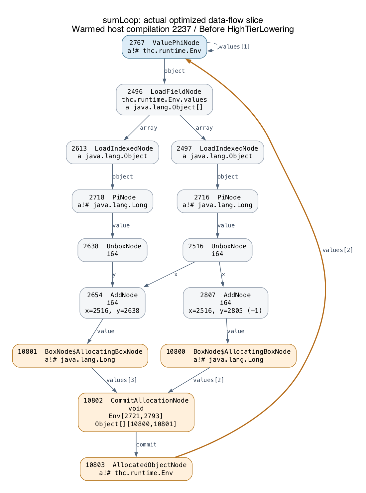

# The actual optimized loop graph

Captured from the working prototype after the entry-lookup fix, using GraalVM 25.3.4.1 and the same `sumLoop` Haskell input as the steady benchmark. This is an inspection of actual compiler output, not a graph inferred from the interpreter source.

The final compilation in the capture is **2237**, the warmed `org.graalvm.polyglot.Value<EntryValue>.execute` target. Its trace reports all three guest calls inlined. Compilation finishes during a ten-second warmup; no subsequent compilation occurs in the measurement or final verification phases. The capture enables graph dumping separately from the performance run, so its timings are not used as performance evidence.



This is a **14-node induced data-flow slice** of the actual `Before phase HighTierLowering` graph: every shown node ID, node class and edge comes from Graal's BGV file. It retains Value/Extension edges between the selected nodes; it omits control edges, guards, constants, debug states and other nodes. It is not the full graph. The two arithmetic nodes consume the unboxed `n` and accumulator; constant `2805 = -1` is outside the displayed slice.

## What the graph actually contains

The full warmed graph has **624 nodes / 67 scheduled blocks before high-tier lowering**, then **3,148 nodes / 422 blocks after low tier**. Lowering expands boxing, allocation, safepoint and other implementation paths, so these are not machine instruction counts. The separately compiled worker has a simpler 184-node graph at the earlier phase; it shows the same defect.

The good result is that the recursive guest call and `TailCall` exception allocation disappear from the continuing loop. There is an actual control-flow backedge. However, the loop has not reduced to two primitive phis, arithmetic and a branch:

- **Heap-carried loop state.** `ValuePhiNode 2767` has stamp `thc.runtime.Env`. Its value is read through `Env.values` (`2496`), `LoadIndexed` (`2497`, `2613`), type refinements (`2716`, `2718`) and unboxing (`2516`, `2638`). These are residual graph operations, not just interpreter source.
- **Materialization on the backedge.** The arithmetic results feed `AllocatingBoxNode 10800/10801`. `CommitAllocationNode 10802` records `Env[2721,2793]` and `Object[][10800,10801]`; `AllocatedObjectNode 10803` feeds the next value of phi `2767`. Thus the continuing path materializes a new `Env` and `Object[2]` and performs two Long boxing operations. The small-Long cache can avoid individual box allocations; it does not remove the two boxing operations or the environment/array materialization.
- **Repeated general-call checks.** The continuing path still follows the parent environment, reloads the closure, and checks arity, supplied-argument length, call target and environment for the known self call. In the simpler worker graph these are directly visible in block B9. It also retains a second backedge comparing the generic result against the `RepeatingNode` continue sentinel, because the accumulator's primitive type has been lost through `Object[]`.

The first optimization to test is **typed primitive loop/frame slots for unlifted binders, with direct self-loop updates**. Keep environments for values that actually need capture, and preserve the correct captured environment when a self call changes it. This should let `n` and `acc` become primitive phis and make the repeated boxing and environment materialization unnecessary. Eliminating the general closure-application path for statically known saturated self calls is the next clear target. These are proposed fixes; this capture shows the current implementation before those changes.

## Original graphs and reproduction

- [Complete warmed-host BGV](graphs/sumloop-warm.bgv), loadable by Ideal Graph Visualizer; contains all dumped phases.
- [Complete scheduled CFG before high-tier lowering](graphs/sumloop-warm-complete-cfg.svg), with actual block successors and scheduled node IDs.
- [All nodes, edges and properties at that phase](graphs/sumloop-warm-optimized-ir.json).
- [All nodes, edges and properties after low tier](graphs/sumloop-warm-low-tier-ir.json).
- [Simpler standalone-worker BGV](graphs/sumloop.bgv) and [complete worker CFG](graphs/sumloop-complete-cfg.svg).

```sh
scripts/try.sh
scripts/dump-graph.sh sumLoop 10000
```

The capture uses `-Djdk.graal.Dump=Truffle:1`, `PrintGraph=File`, `PrintGraphWithSchedule=true`, and `PrintBackendCFG=true`. `tools/GraphInspect.java` reads the binary files using the **bundled Graal BinaryReader/ModelBuilder APIs**, exporting actual nodes, typed edges, block successors and source positions. Original capture logs and textual final schedules are under `work/graphs/sumLoop/`. Dumping changes compile time; use `scripts/benchmark.sh` for performance runs.
