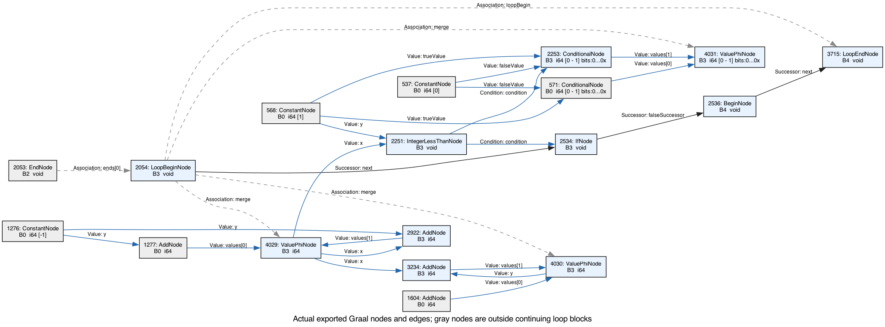

# Actual Graal graphs after the Cadenza frame and closure port

Captured on 2026-09-22 from the final executable implementation, including GHC safe-evaluation annotations and typed constructor layouts. These are original Graal BGV graphs and scheduled graph exports, not diagrams inferred from interpreter source. Graph dumping ran separately from the performance benchmark.

## The summation loop now carries primitives



This view copies actual node IDs and typed edges from worker compilation **1869**, `Before phase HighTierLowering`. Blue nodes are in the continuing natural-loop blocks; gray nodes show incoming constants and initial values. Debug-state objects are omitted from the rendering but included in the checker. Association edges are compiler-graph relationships, not machine control-flow edges.

The real CFG backedge is **B3 → B4 → B3**, with LoopBegin **2054** and LoopEnd **3715**. Counter phi **4029** and accumulator phi **4030** both have `i64` stamps. The counter update is Add **2922** with constant **1276 = -1**; the accumulator update is Add **3234**. IntegerLessThan **2251** and If **2534** control continuation. A third, range-limited `i64` phi **4031** preserves the Core comparison result for frame/deoptimization state; it is not a heap-carried environment.

All **13 scheduled nodes** in those continuing blocks pass the structural check: **no allocation, boxing/unboxing, heap loads, or calls**. Virtual frame/object-state descriptions do not allocate. The worker still boxes its result on exit to the Object return ABI.

The warmed Polyglot host compilation **2169** inlines all three guest calls and has the same primitive recurrence: phis **2057/2058**, LoopBegin **1924**, and **B30 → B31 → B30**. The checker identifies that summation loop separately from host argument-conversion loops. Host conversion and result boxing remain outside it.

| Actual graph snapshot | Previous Env implementation | Cadenza frame implementation |
|---|---:|---:|
| Standalone worker, before high-tier lowering | 184 nodes | 84 nodes |
| Warm host, before high-tier lowering | 624 nodes / 67 blocks | 391 nodes / 43 blocks |
| Warm host, after low tier | 3,148 nodes / 422 blocks | 1,077 nodes / 143 blocks |

These are graph-node counts, not instruction counts. Later lowering introduces allocation slow paths, safepoint handling and loop transformations. The earlier [Env graph report](graph-inspection-before-frames.md) preserves the original failure: an Env phi, boxed arithmetic results, and Env/Object-array materialization on every backedge.

## Captures, constructors and application

The final standalone entry graphs show:

| Entry | Compilation | Before-high nodes | Actual residual behavior |
|---|---:|---:|---|
| `captured` | 1955 | 198 | All guest callees inline; capture/closure scalar-replaced; no method invokes. |
| `under` | 1943 | 272 | One `Closure.pap` boundary. A PAP prefix array remains; constructor payload arrays and argument thunks are absent. |
| `over` | 1968 | 446 | All guest callees inline; no method invokes or PAP boundary. |
| List builder | 2038 | 30 | Four typed objects per element; no per-cell array or allocated Long box. |
| List traversal worker | 2139 | 768 | All guest callees inline; primitive count/accumulator loop slots and direct constructor-field reads. |
| Changing-capture worker | 2018 | 564 | Primitive capture restoration; one direct-long Box on each continuation edge, with no argument thunk/capture there. |

### List cells are now direct fields

The original `DataValue(constructor, name, Object[] fields)` encoding has been removed. On this JVM, Truffle uses field-based StaticShape storage. Each constructor has a shared layout and generated storage class:

- `Cons`: shared layout reference, direct head reference, direct lazy-tail reference.
- The fixture's `Box Int#`: shared layout reference and a direct `long` field.
- `Nil`: one shared instance per layout.
- Zero-width coercion/void slots have logical indices but allocate no field.

Cases compare layout identity, and restore primitive fields directly to primitive frame slots. Field types come from GHC's `typePrimRep_maybe` metadata, not levity guesses or parsed type strings. Unknown, unsupported and multi-register field representations fail explicitly.

This is visible in the **actual list-builder graph**, not just the runtime class definitions. CommitAllocation **1822** contains the generated Cons storage (VirtualInstance **1821**, fields `layout/field__0/field__1`), generated Box storage (VirtualInstance **1767**, fields `layout/field__0` with an `i64` operand), a tail Thunk and its typed capture. After mid-tier lowering, these are exactly four NewInstance nodes **2926/2934/2939/2948**, with **no NewArray or allocating Long box**. The traversal reads Cons references at **8565/8657** and its head's primitive value at **11222**.

Thus one produced element still requires **Cons + Box + tail Thunk + capture**. These are ordinary lazy lists, not fused or unboxed lists. The thunk and capture remain separate allocations. GHC's representation is still more compact; the source/runtime layout should not be confused with a claim of native-size objects.

### Capture and application costs that remain

Underapplication retains Cadenza's explicit PAP boundary. Commit **5756** contains its prefix Object array; that array is the application payload, not a per-constructor field array. The PAP closure and copied prefix allocate beyond the boundary and therefore are not themselves CommitAllocationNodes in the caller graph. Captured and overapplied guest calls inline completely; boxed Object-ABI returns and conditional CAF-initialization paths remain.

The changing-capture worker has a primitive remaining-argument phi **21443** at LoopBegin **7036**. Both continuation edges B53/B54 commit only a direct-long Box (**21505/21507**) before LoopEnds **21151/13437**. Those boxes remain as actual NewInstance nodes **23332/23339** after mid tier. **The loop is not allocation-free**, but its former argument Thunk/capture materialization is gone. Factory closure/thunk/capture commit **21498** belongs to the state-0 initialization path; the state-2 path reads cached value **11134** and bypasses it. SCC membership alone would not justify claiming factory allocation on every warmed iteration.

That improvement uses GHC's canonical `exprOkForSpecEval`, with all enclosing recursive-group binders excluded as in CorePrep. Its certificate is authoritative when present; `exprIsHNF` remains a fallback for older exports. This covers total primitive operands such as `Box (n -# 1#)` while protecting divide-by-zero and recursive dictionary knots. The compiler pipeline now has regressions for those distinctions. The runtime regression verifies that warmed changing-capture traversals introduce no new thunk evaluations.

Graph inspection also caught a Kotlin failure-path defect: a non-null throwable cast in thunk rethrow pulled NPE stack-trace construction into successful compiled functions. That path now deoptimizes before rethrow while retaining memoized failures. The stack-trace machinery disappears from the final graphs.

## Original artifacts and reproduction

- [Worker BGV](cadenza-graphs/sumloop-worker.bgv), [complete before-high graph](cadenza-graphs/sumloop-worker-before-high.json), [after-low graph](cadenza-graphs/sumloop-worker-low.json), [loop CFG](cadenza-graphs/sumloop-worker-loop-cfg.svg), [checker evidence](cadenza-graphs/sumloop-worker-check.json).
- [Warmed host BGV](cadenza-graphs/sumloop-host.bgv), [complete before-high graph](cadenza-graphs/sumloop-host-before-high.json), [after-low graph](cadenza-graphs/sumloop-host-low.json), [checker evidence](cadenza-graphs/sumloop-host-check.json).
- [Captured closure BGV](cadenza-graphs/captured-guest.bgv), [underapplication BGV](cadenza-graphs/under-guest.bgv), [overapplication BGV](cadenza-graphs/over-guest.bgv). Their JSON graphs, call trees and evidence files are saved alongside them.
- [List-builder BGV](cadenza-graphs/case-list-builder.bgv), [actual list-builder graph](cadenza-graphs/case-list-builder-before-high.json), [after-mid-tier graph](cadenza-graphs/case-list-builder-after-mid.json), [list traversal BGV](cadenza-graphs/case-list-worker.bgv), and [changing-capture BGV](cadenza-graphs/changing-env-worker.bgv).
- [Typed-data graph manifest](cadenza-graphs/typed-data-manifest.json).
- [Capture provenance and hashes](cadenza-graphs/sumloop-manifest.json). Full raw runs, including changing captures, are under `work/graphs/cadenza-data-*` in the source workspace.

```sh
scripts/try.sh
scripts/dump-graph.sh sumLoop 10000
python3 tools/check-sum-loop-graph.py docs/cadenza-graphs/sumloop-worker-before-high.json
python3 tools/check-sum-loop-graph.py docs/cadenza-graphs/sumloop-host-before-high.json
```

`tools/GraphInspect.java` uses the Graal BinaryReader/ModelBuilder bundled with the installed compiler. `tools/check-sum-loop-graph.py` derives natural loops from actual scheduled successors, dominators and LoopBegin/LoopEnd associations. It identifies primitive induction/accumulation recurrences and checks every scheduled node on their continuing paths, failing on unreviewed operation classes. It rejects the earlier Env graph and injected allocation/load/call/object-phi regressions. This gate applies to the named compiler snapshot; complete BGVs retain all later phases for inspection.
