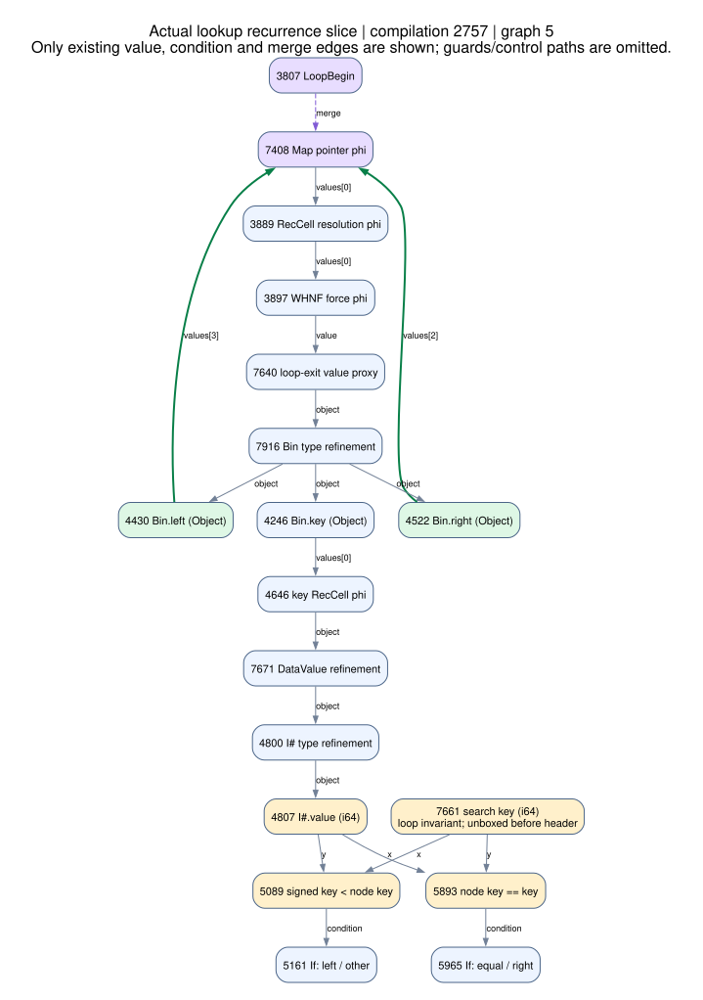

# Ordinary `Data.Map.Strict` on THC

The [Map workload](../examples/THC/MapWorkload.hs) runs ordinary `containers` code through exported GHC Core and THC. In this run, a complete workload took **3.101 ms on THC versus 1.326 ms on native GHC: 2.339× GHC's time**. Both engines built the same unmodified `containers-0.8` sources. The native comparison, compiled-result checks, and graph inspection all use the real histogram/update/lookup/fold workload.

This report records the initial implementation at `60148ed`. The [call-packet follow-up](call-packets.md) retains subsequent changes, measurements, and compiler graphs; the numbers and graph IDs below refer to this original baseline.

This result uses **explicit diagnostic mode**. The complete syntactic dependency audit remains **`accepted: false`**, with three unresolved globals and thirteen unsupported sites on retained exception/backtrace paths. Default strict loading rejects this bundle. Diagnostic loading preserves traps at unsupported expressions; every tested and timed execution reported **zero unsupported traps**. General Haskell exception/IO compatibility remains unfinished.

## Workload and compilation

For input `n`, the workload builds a histogram with `Map.insertWith (+)`, adjusts existing values with `Map.adjust`, performs successful and unsuccessful `Map.findWithDefault` queries, and consumes the result through `Map.foldlWithKey'` and `Map.size`. Keys spread across 4,096 buckets; queries also include absent keys. The source uses ordinary `Int`, `foldl'`, range lists, and the public `Data.Map.Strict` API. GHC `-O2` removes range-list allocation and numeric dictionaries and produces the specialized loops being executed.

[The export driver](../compiler/export-map.sh) downloads a hash-pinned `containers-0.8` archive, verifies every extracted source file, and compiles the workload and library sources together. Its source SHA-256 is `b1c1127ff57b6f844d0b30cea54a62c01ca146a49ed4953485be1af389a94bd8`. The plugin exports executable Core expressions from GHC 9.14.1. Dependency closure uses actual interface unfoldings and targeted genuine boot-library source exports. Compiler-generated identities, unary dictionaries, `runRW#`, and zero-width tokens receive GHC's canonical erasure/expansion. No Map operation has a runtime intrinsic.

The retained [source provenance](map-graphs/provenance.json) and [dependency audit](map-graphs/reachability-audit.json) describe the exact bundle: 1,619 supplied bindings and 52 syntactically reachable globals across the 17-module manifest. Reachability respects lexical scope, including recursive groups and case binders. It intentionally includes unexecuted branches.

## Validation and timing

A clean source-only checkout with an empty build cache passed the fixture and Map pipelines: **37 JVM tests**, plus **18 Map inputs checked before and after requested last-tier compilation**. Inputs include negatives, zero, bucket boundaries, 10,000, 65,536, and 100,000. The native oracle also matches an independent histogram calculation. [Validation](../bench/results/map/validation.json) and [oracle inputs](map-graphs/oracle-validation.json) are retained.

The timing machine was an Apple M3 with 16 GiB, macOS 15.5, GHC 9.14.1, and GraalVM 25.3.4.1 / JDK 25. Each engine ran in three fresh processes, serially. Each JVM warmed for at least 15 seconds and 256 calls; native processes warmed for one second. Each process then ran five windows of at least two seconds. Inputs varied over a 16-value cycle starting at 10,000, and every output contributed to a consumed checksum. Startup, loading, and warmup are excluded; the Polyglot host invocation is included.

| Engine | Median workload time | Per-process median range |
|---|---:|---:|
| Native GHC `-O2` | 1.325825 ms | 1.323641–1.353897 ms |
| THC / Graal | 3.101204 ms | 3.019110–3.178544 ms |
| THC / GHC | **2.339075×** | |

The headline is the median of the three process medians. All **30 measurement windows** matched checksums, and the logs contain **zero Truffle compilation/deoptimization events during measurement**. Final last-tier verification succeeded in all three JVMs. The raw ranges and drift are retained; no timing windows were discarded. This is one machine/workload measurement; the graph and allocation observations do not causally attribute the entire timing gap. See [all windows](../bench/results/map/timings.tsv), [summary](../bench/results/map/summary.json), and [run configuration](../bench/results/map/run-config.json).

A separate allocation probe measured approximately **11.50 MB per workload on the JVM versus 7.07 MB for native GHC**, or **1.625× allocation volume**. The JVM number is the median of three 256-call windows after warmup and requested compilation, using current-thread `ThreadMXBean` accounting. The native estimate subtracts RTS totals for 16 calls from 272 calls and divides by 256, preserving the input cycle. These measure allocation volume, not retained memory: the JVM count excludes other threads, and the native result is a process-total difference. The probe observed zero unsupported traps. See [allocation methods and results](../bench/results/map/allocation-summary.json), [JVM samples](../bench/results/map/allocation-jvm.tsv), and [native 272-call sample](../bench/results/map/allocation-native-272.tsv).

## What the actual compiler graphs show

The first insertion compilation failed at Graal's existing graph-cost limit of 100,000. Its partial-evaluation snapshot contained 65,176 nodes. It expanded 547 generic frame reads into every frame kind, including 547 each of Byte, Float, Double, and Int boxing nodes that this runtime never needed. It also contained 171 `StringLatin1.equals` loop headers from comparing case-alternative kind strings. The [failed graph and evidence](map-graphs/failed-insert-pe-evidence.json) retain those exact counts and node IDs.

The runtime now reads its actual Long/Boolean/Object frame tags directly, preserving the tags of older primitive frames after descriptor widening. Case alternatives use parsed integer labels. A separate self-tail profile also keeps an unused self-loop body cold. The original graph-cost limit remains unchanged. The final workload compiles successfully; all nine selected final graphs contain zero `String.equals`/`StringLatin1.equals` source nodes, zero surviving root-PE `VirtualFrameGet` nodes, and no allocating Byte/Float/Double/Int box nodes.

The table reports actual nodes after root partial evaluation and before high-tier lowering. Residual calls and allocation commits are counted at the latter phase, after Truffle inlining. A commit site can allocate multiple objects and may lie on a conditional path; **these are static sites, not allocations per iteration**.

| Compiled role / ID | Root PE nodes | Before lowering | `callBoundary` sites | Allocation commit sites |
|---|---:|---:|---:|---:|
| Insert / 2568 | 1,381 | 4,609 | 21 | 55 |
| Adjust / 2708 | 519 | 2,495 | 8 | 28 |
| Lookup / 2757 | 937 | 651 | 0 | 6 |
| Weighted fold / 2794 | 943 | 5,240 | 16 | 55 |
| Query loop / 2813 | 719 | 3,317 | 0 | 24 |
| Balance A / 2816 | 788 | 451 | 0 | 7 |
| Range loop (`x, v`) / 2829 | 929 | 8,324 | 31 | 90 |
| Balance B / 2844 | 1,402 | 4,071 | 16 | 46 |
| Entry / 2880 | 81 | 178 | 1 | 1 |

The fold and range-loop graphs also retain two `Long.longValue` method targets each. The two balance roots share the display name `lambda k, x, l, r`; A/B identify their compilation IDs without assuming which name was `balanceL` or `balanceR`. The [manifest](map-graphs/manifest.json) links per-role evidence with exact call and allocation IDs. [Selected raw BGVs](map-graphs/final-selected-bgv.zip) preserve all phases for these nine compilations in a compressed archive; the earlier failed graph is [archived separately](map-graphs/failed-insert-pe.zip).

### Lookup recurrence

The lookup search has a loop-carried Map pointer, an invariant primitive `i64` search key, direct left/right child loads, and primitive comparisons. The normal descent paths contain **no allocation and no residual calls**. This claim follows control flow: all six allocation commits are dominated by the unforced-result-thunk branch, at block B61 or B77. Memoized state 2 reuses the stored value. The retained state switches and dominator proof are in [lookup-path-proof.json](map-graphs/lookup-path-proof.json).



Every arrow above exists in graph 5 of compilation 2757. This is a data/condition/merge-edge slice; omitted guards and control paths are not replaced by invented edges. Nodes 4430 and 4522 feed the child pointer back into phi 7408 at loop header 3807. Node 7661 unboxes the invariant search key before the loop. Node 4807 reads the current node's primitive key, feeding comparisons 5089 and 5893. The [selected nodes and edges](map-graphs/lookup-recurrence-nodes.json) and [DOT](map-graphs/lookup-recurrence.dot) make the rendering auditable.

### Stored tree representation and remaining costs

`Bin` is a generated StaticShape object with a layout reference, a **direct primitive long size**, and **four direct object fields**: key, value, left, and right. There is no per-Bin `Object[]` payload or boxed size. Haskell `Int` keys and values remain separate `I#` objects, each storing its primitive long directly. In balance graph 2816, virtual instance 11589 lists the complete field layout; commit 12181 builds two Bin objects using primitive `i64` size nodes 3996 and 4648. [The exact representation proof](map-graphs/bin-layout-proof.json) retains these nodes.

Updates still allocate persistent tree nodes and boxed Haskell values. Larger inlined update/fold graphs also retain call packets, lazy thunks/captures, and call boundaries. For example, the insertion graph contains 31 committed Bin descriptions, 13 `I#` descriptions, 28 packet arrays, and four thunk/capture pairs distributed across its branches. Lookup's small allocation-free descent therefore does not make the complete workload allocation-free. The residual update calls, packet traffic, boxed key/value objects, and conditional forcing are concrete places to investigate next; the graph counts alone cannot quantify their share of the 2.339× timing ratio.

## Explicit dependency frontier

The three unresolved globals are:

- `ghc-internal:GHC.Internal.Exception.$fExceptionErrorCall_$ctoException`
- `ghc-internal:GHC.Internal.Exception.Backtrace.collectExceptionAnnotationMechanismRef`
- `ghc-internal:GHC.Internal.Stack.withFrozenCallStack1`

The thirteen capability issues are four unboxed-tuple construction/matching sites, eight tuple-field representation issues, and one `readMutVar#` site. They remain visible in the [strict audit](map-graphs/reachability-audit.json), including caller paths. A runtime trap at an enclosing expression can cover multiple nested audit issues, so the shorter runtime trap inventory is not a complete compatibility inventory. String literals and managed literal-address decoding, strict lifted constructor fields, and lazy-payload `raise#` are supported; general stateful exception/backtrace collection remains outside this implementation.

## Reproduction

Set `JAVA_HOME` to the required GraalVM JDK and make GHC 9.14.1 available as described in the repository setup. Default strict mode exposes the incomplete dependency frontier. The explicit diagnostic run used here is:

```sh
THC_DIAGNOSTIC_UNSUPPORTED=true scripts/try-map.sh
THC_DIAGNOSTIC_UNSUPPORTED=true scripts/benchmark-map.sh bench/results/map-repeat

THC_DIAGNOSTIC_UNSUPPORTED=true \
THC_GRAPH_MIN_WARM_CALLS=256 \
THC_GRAPH_MODULES="$(paste -sd, build/map/modules.txt)" \
scripts/dump-graph.sh mapAggregate 10000 work/graphs/map-repeat
```

Graph dumping is separate from timing. Full CFG/phase dumps can be large; this report retains selected compressed raw graphs and small evidence extracts. All Map graph artifacts, including the failed compilation archive, total approximately 14.3 MB.
