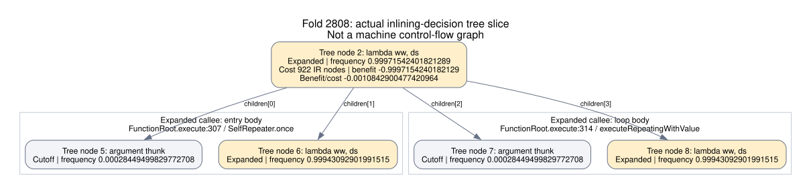

# What blocks Map call-target inlining?

The remaining Map calls have **known, constant targets**. Partial evaluation duplicated the function entry and loop body, and the inliner counted their shared call profiles twice. The retained change switches to one loop entry after observing a self-tail call. It fixes the fold's duplicated profiles and reduces measured allocation by **4.666%** beyond the call-packet change, with **no demonstrated CPU gain**. Applying the loop entry to every root was **13.8% slower** and was rejected.

The following baseline audit explains the original decisions; the candidate results appear below. Losing target identity or hitting the indirect-call fallback does not explain these residual calls.

The historical baseline audit uses the actual phase-one graphs from runtime commit `9a60b99b5a4a2196dd5184e783c7e3f852444a15`, the same binary measured in the [call-packet report](call-packets.md). Each BGV contains an **After Inline** call tree with decisions, frequencies, recursion depths, costs, and thresholds. The [complete compact audit](inlining-graphs/phase1-call-tree-audit.json) retains exact node IDs and source positions.

| Compiled root | Compilation | Inlined guest calls | Residual guest calls | Unexpanded frontier | Explored but declined |
|---|---:|---:|---:|---:|---:|
| Insert | 2600 | 9 | 21 | 20 | 1 |
| Weighted fold | 2808 | 15 | 17 | 15 | 2 |
| Range loop | 2849 | 24 | 30 | 25 | 5 |

Every one of these **68 residual guest calls** has a `ConstantNode` target receiver in the final structured graph. The audit counts only the active frontier: children beneath a declined call are considered by the policy but are not additional calls in the compiled caller. Separate `Long.longValue` calls in fold/range are Java calls and are excluded from this table.

## Exploration stops before target information runs out

The installed GraalVM 25.3.4.1 selects the **Agnostic** inlining policy. Both its expansion and inlining budgets default to 12,000; THC's separate 100,000 graph bailout limit is unchanged. The recursion option defaults to 2, but this policy interprets it as a **penalty-free depth**, not a hard limit. Depth-two insertion calls have no recursion penalty.

A call tree node starts in `Cutoff`, meaning unexpanded. Expansion compares its estimated benefit with a graph-size-dependent threshold:

```
exp((explored_subtree_IR_nodes - 2 * 12000) * 6 * ln(10) / 12000)
```

For insertion, the immediate self-calls at tree nodes **1 and 4** are inlined. Their next recursive calls remain unexpanded. The final explored subtree has 27,952 IR nodes, making its expansion threshold **94.6237**; hot depth-two node **8** has estimated expansion benefit **0.22737**. All 20 active cutoffs fail that final test, including nonrecursive balance calls. Fold and range have different thresholds, but all their active cutoffs also fall below the final threshold.

This establishes why the final state cannot expand further under those estimates. The retained graph does not record the full queue history or a unique earlier rejection event. It would be inaccurate to label every `Cutoff` a recursion-limit failure. [Pinned policy source hashes](inlining-graphs/pinned-policy-provenance.json) identify the bundled implementation: `AgnosticInliningPolicy.java` lines 416–446 define expansion, 527–528 define the threshold, and 773–777 interpret the recursion option.

## The fold's negative score is more specific

The two hot direct fold self-calls are **Expanded**, not `Cutoff`. The policy has looked at their bodies and declined them. Its base benefit is the incoming call frequency minus the sum of outgoing child-call frequencies; candidate clusters can improve that score.



This is a slice of compilation **2808**, call-tree graph **2**, with actual nodes and edges. [DOT](inlining-graphs/fold-decision-slice.dot), [PNG](inlining-graphs/fold-decision-slice.png), and [node data](inlining-graphs/fold-decision-slice.json) are available. It is an inlining decision tree, not machine control flow.

At tree node **2**, incoming estimated frequency is **0.9997154240182129**. Its children have frequencies `[0.0002844949982977271, 0.9994309290199151]` twice. Their sum is exactly twice the incoming estimate, so benefit is **−0.9997154240182129**. Dividing by the 922-node cost gives **−0.0010842900477420964**, exactly the recorded `Inline BpC`. Its sibling node **4** has the same calculation. Increasing only the inlining budget cannot make a negative score beat a positive threshold.

The two child pairs come from the callee's separate entry-body and loop-body copies. In PE graph 0, invoke nodes **515/1766** come from `FunctionRoot.execute:307`; **3573/4764** come from `FunctionRoot.execute:314` through `SelfRepeater.executeRepeatingWithValue`. In the final graph the self-call targets are **14702** and **15171**, both using constant target **1**. The first uses the entry path, the second the loop path.

The graph establishes that these copies share their counters. Entry and loop thunk invokes **515/3573** both receive the same `OptimizedDirectCallNode` constant **496**; fold invokes **1766/4764** both receive constant **1759**. The pinned `CallNode.addChildren` builds a model node for each surviving invoke, and its frequency calculation reads the AST call-node counter divided by the enclosing target counter. There is no CFG weighting or deduplication by that constant identity. Thus each copy receives the same aggregate count, even though the shared counter already includes both entry and loop executions. [Exact nodes and argument edges](inlining-graphs/fold-shared-call-profile-proof.json) preserve the identity proof.

These are compiler estimates, not evidence that the guest actually does twice the work. Real recursive calls can occur during the first execution and later iterations; the defect here is counting their already aggregated profile twice in the inlining model. The experiments below give the compiler one loop-body entry while preserving the same self-tail handler and inlining policy.

## Other declined edges

The insertion root has one explored but declined balance edge, tree node **5**, at relative frequency **0.00120**. Its benefit/cost is **3.35e−8**, below threshold **1.53e−5**. That is a cold cost-model rejection, despite a known target.

The range loop's five explored but declined edges comprise one insertion call plus paired fold and query calls. Its insertion edge, node **18**, has positive benefit/cost **5.22e−6**, below threshold **1.59e−5**. The fold and query edges have negative scores after cluster analysis. Some other balance/insertion calls remain unexpanded. The audit records each path separately, rather than attributing all residual calls to one global limit.

## Rejected candidate: one function-loop entry

The candidate enters `LoopNode.execute` directly and uses the existing `SelfRepeater` for first execution and subsequent tail iterations. The manually separate `once` call and catch-to-loop path are removed. All **41 tests** and **18 Map inputs before and after requested compilation** pass with zero traps. The frozen runtime JAR is identified in the [candidate provenance](inlining-graphs/single-loop-provenance.json). Inlining policy, budgets, and graph limits are unchanged.

The fold's initial PE graph shrinks from **913 to 495 nodes**, and the explored fold callee from **922 to 536 nodes**. Candidate compilation **2792**, tree nodes **2 and 4**, now inlines two levels of hot self-calls. Node 2 has positive cluster benefit/cost **2.9063e−8**, above threshold **1.0952e−10**. Its outgoing children are one thunk/call pair; the duplicated pair is gone.

| Root | Residual guest calls, baseline → candidate | Late Object arrays | Late Long allocations |
|---|---:|---:|---:|
| Insert | 21 → 21 | 18 → 18 | 18 → 18 |
| Weighted fold | 17 → 16 | 18 → 16 | 18 → 19 |
| Range loop, root 31 | 30 → 21 | 28 → 21 | 28 → 19 |
| Balance, root 15 | 21 → 15 | 18 → 13 | 18 → 13 |
| Lookup | 0 → 0 | 0 → 0 | 0 → 0 |

These are static allocation sites, not dynamic counts per workload. The result is not uniform: insertion's initial PE graph grows from 1,365 to 1,670 nodes, while its residual calls are unchanged. The fold adds one surviving primitive box and one `Long.longValue` call. The range loop improves substantially, and lookup retains its zero-allocation/call gate. [Complete graph and call-tree comparison](inlining-graphs/single-loop-graph-comparison.json) records all ten roots.

The candidate passed the graph gate and reduced current-thread allocation from **11,169,058.72 to 10,738,104.50 bytes per workload**, a further **3.858%** reduction. However, the controlled timing run measured **3.315280 ms** against **2.912829 ms** for phase one, a **13.8% regression**; native GHC measured 1.297747 ms. All 45 windows passed validation. This candidate is rejected.

There was desktop variation: the third baseline process reached a 5.266 ms median, whereas its first two were 2.910 and 2.913 ms; candidate process medians were 3.169, 3.322, and 3.315 ms. The result does not establish a universal penalty for one loop entry, but it does not justify retaining this candidate for the tested workload. [Timing and samples](../bench/results/map-single-loop/comparison/summary.json), [validation](../bench/results/map-single-loop/comparison/validation.json), and [allocation method](../bench/results/map-single-loop/allocation-summary.json) retain the measurements.

[Selected actual BGVs](inlining-graphs/selected-inlining-bgv.tar.xz) contain the phase-one fold and candidate fold/range graphs. The following experiment narrows the change to roots observed taking a self-tail call.

## Retained change: switch only after observing a self-tail call

The narrower candidate keeps the original entry path until a function first takes a self-tail call. That event invalidates compiled code and sets a compilation-final flag; future compilation selects the loop-only path. Functions that never encounter a self-tail call keep their entry argument facts. The existing self-tail handler still restores captures and preserves bloom ancestry.

All **43 tests** and **18 Map inputs before and after compilation** pass with zero traps. Its [frozen source/JAR provenance](inlining-graphs/profiled-self-loop-provenance.json) and [three-way graph comparison](inlining-graphs/profiled-self-loop-comparison.json) record the exact candidate. The inlining policy and budgets are unchanged.

The intended graph result holds: insertion, adjustment, both balance roots, and the entry root recover the phase-one before-high/after-mid node counts, residual calls, arrays, and Long allocations. Fold compilation **2763** retains the smaller **536-node callee** and inlines hot self-call tree nodes **2 and 4**. Node 2's cluster score **2.9389e−8** exceeds its **1.0387e−10** threshold.

| Root | Residual guest calls, phase one → candidate | Late Object arrays | Late Long allocations |
|---|---:|---:|---:|
| Lookup | 0 → 0 | 0 → 0 | 0 → 0 |
| Query loop | 0 → 0 | 0 → 0 | 1 → 1 |
| Weighted fold | 17 → 16 | 18 → 16 | 18 → 19 |
| Range loop, root 31 | 30 → 20 | 28 → 17 | 28 → 18 |
| Range loop, root 36 | 14 → 18 | 12 → 15 | 14 → 16 |

These are static sites, not dynamic counts per workload. Lookup shrinks from **605 to 389** nodes before high-tier lowering; the query loop shrinks from **3,133 to 1,201**. Query remains free of call packets and residual calls, but retains one primitive result box. Range root 31 shrinks from **7,794 to 5,579** before-high nodes. The result is still mixed: range root 36 gains residual calls, arrays, and boxes, and the fold's after-mid graph grows from **11,612 to 11,963** nodes as more code inlines. The fold also retains three `Long.longValue` calls, versus two in phase one; these Java calls are separate from the guest-call table.

Measured current-thread allocation falls from **11,169,058.72 to 10,647,949.00 bytes per workload**, a further **4.666%** reduction from phase one and **7.377%** below the original runtime. [Samples and method](../bench/results/map-profiled-self-loop/allocation-summary.json) retain all three allocation windows. This is allocation volume rather than retained heap.

The controlled run measured **2.925187 ms** against **2.943543 ms** for phase one, a ratio of **0.993764**. This **0.624%** difference is within the observed variation and does not establish a CPU gain. Native GHC measured **1.295075 ms**, giving a candidate/native ratio of **2.2587**. All **45 windows** passed validation, with zero measured Truffle compilation/deoptimization events and zero unsupported traps. [Timing summary](../bench/results/map-profiled-self-loop/comparison/summary.json), [validation](../bench/results/map-profiled-self-loop/comparison/validation.json), and [configuration](../bench/results/map-profiled-self-loop/comparison/run-config.json) retain the full run.

Baseline process medians were **2.839, 2.944, and 3.442 ms**; candidate medians were **3.017, 2.871, and 2.925 ms**. The last windows of both third JVM processes slowed during this desktop run. We retain the narrower change for its measured allocation reduction and removal of duplicated self-call profiles, without claiming a throughput improvement.

[Selected actual BGVs](inlining-graphs/profiled-self-loop-selected-bgv.tar.xz) preserve insertion, lookup, fold, query, and both range roots, including the adverse range-root-36 result. The [capture log](inlining-graphs/profiled-self-loop-capture.log), [capture checksum](inlining-graphs/profiled-self-loop-capture.tsv), and [artifact manifest](inlining-graphs/manifest.json) accompany them.
